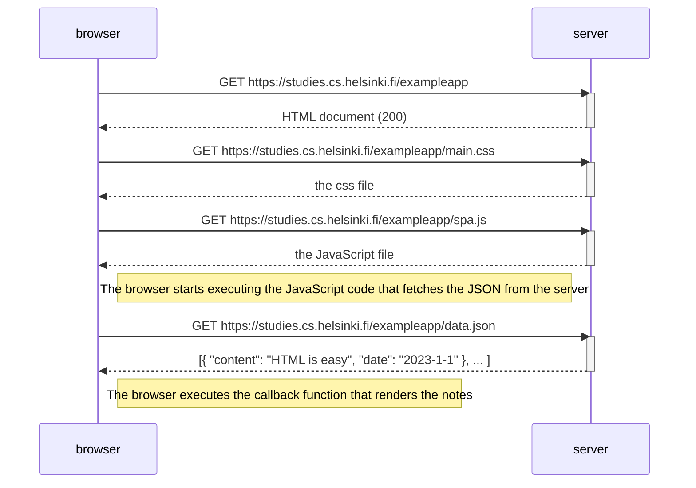
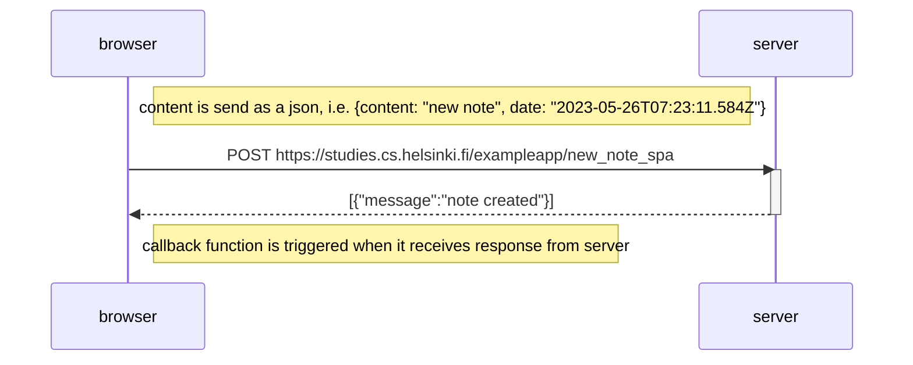

# 0.5: Single page app diagram

## 0.5 Loading the page

```mermaid
sequenceDiagram
    participant browser
    participant server

browser->>server: GET https://studies.cs.helsinki.fi/exampleapp
activate server
server-->>browser: HTML document (200)
deactivate server

browser->>server: GET https://studies.cs.helsinki.fi/exampleapp/main.css
activate server
server-->>browser: the css file
deactivate server

browser->>server: GET https://studies.cs.helsinki.fi/exampleapp/spa.js
activate server
server-->>browser: the JavaScript file
deactivate server

Note right of browser: The browser starts executing the JavaScript code that fetches the JSON from the server

browser->>server: GET https://studies.cs.helsinki.fi/exampleapp/data.json
activate server
server-->>browser: [{ "content": "HTML is easy", "date": "2023-1-1" }, ... ]
deactivate server

Note right of browser: The browser executes the callback function that renders the notes
```

## 0.6 New Note in SPA diagram:

```mermaid
sequenceDiagram
    participant browser
    participant server

Note right of browser: content is send as a json, i.e. {content: "new note", date: "2023-05-26T07:23:11.584Z"}
browser->>server: POST https://studies.cs.helsinki.fi/exampleapp/new_note_spa
activate server
server-->>browser: [{"message":"note created"}]
deactivate server

Note right of browser: callback function is triggered when it receives response from server

```

